# Project : Line-Lane-Follower-Robot Using ROS-Kobuki-Turtlebot
The project is done at University of Alberta (UoA) for the course CMPUT 412 : Experimental Robotics.

## Overview
The robot detects and follows a line/lane with RGB camera.


## Dependencies

We tested our project on the following environment.
* Ubuntu 14.04
* Python 2.7.6
* ROS Indigo
* Numpy
* Matplotlib
* OpenCV-Python 2.4.8

How to configure Gazebo world for line follower:
clone followbot folder into your_workspace/src. For test 
```
cd your_workspace/src
roslaunch followbot course.launch
```
In our case, saving followbot files in a src/package didn't work. 

How to configure Joy:
http://wiki.ros.org/joy/Tutorials/ConfiguringALinuxJoystick

## How to run 
### Collect Camera Images
Run the following to record images into the imageFolder of your current directory.
```
mkdir imageFolder
cd imageFolder
rosbag record camera/rgb/image_raw --limit=60 -o bagFileName 
```
limit = 60 is the total number of frames collected.
Initialize joystick or remote keyboard teleop before to maneuver the robot and record.

Run the following to extract raw ROS bag files into JPEG.
```
rosrun packageName rosbag_play.py bagFileName.bag /Folderlocation/ camera/rgb/image_raw
```

### Perspective Calibration

The perpective transform turns the input image into a top view image so that the lines on either side is more seperable.We can run pers_calibration.py and it needs 4 locations to be transformed into 4 target locations and pass it to getPerspectiveTransform() function of opencv.It will return as a homography matrix whcih we shall multiply to transform all the input images to get the birds eye view of the track.

<div align="center">
  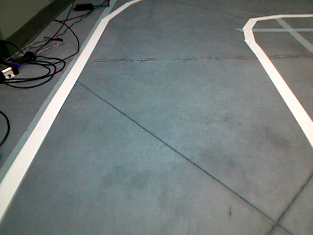 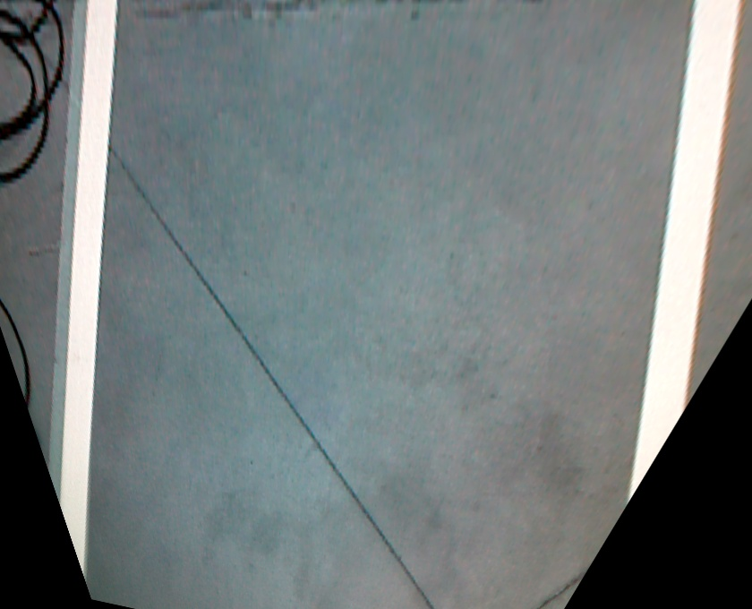 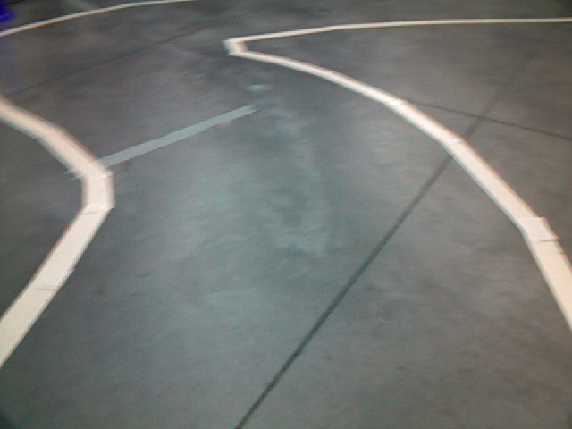 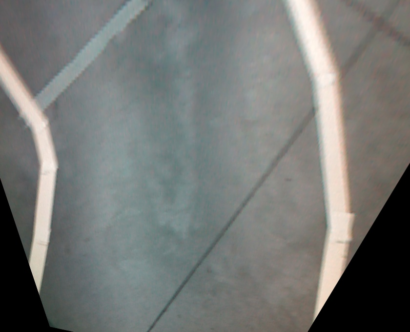
</div>
<div align="center">
  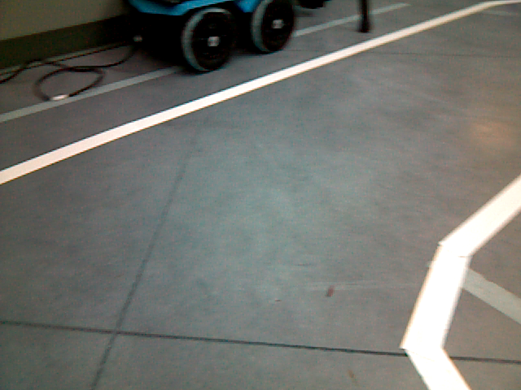 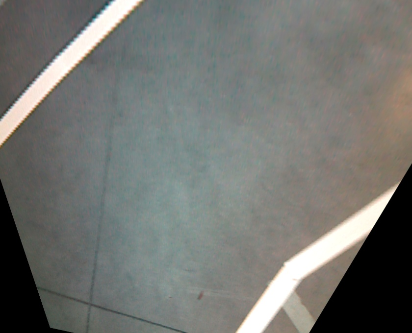 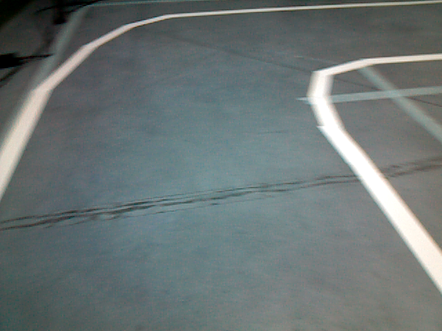 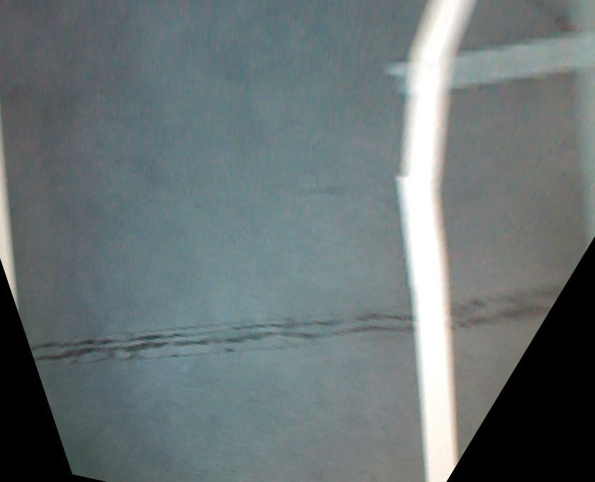
</div>


### Line/Lane (yellow or white) Following Robot
#### In Turtlebot Gazebo Simulation 
```
roslaunch followbot course.launch
cd catkin_ws
source devel/setup.bash
chmod +x fileName.py
catkin_make
rosrun packageName white_yellow_line_follower_sim.py
#Or run this for lane following
rosrun packageName white_yellow_lane_follower_sim.py 
```
#### In Kobuki Turtlebot
```
roslaunch turtlebot_bringup minimal.launch
roslaunch turtlebot_bringup 3dsensor.launch
roslaunch turtlebot_teleop logitech.launch 
```

If joystick appears on js1 other than js0:
```
ls -l /dev/input/js1
roslaunch packageName joy.launch #refer joy.launch in project files
```
```
cd catkin_ws
source devel/setup.bash
chmod +x fileName.py
catkin_make
rosrun packageName white_yellow_line_follower_sim.py
#Or run this for lane following
rosrun packageName white_yellow_lane_follower_sim.py 
```

## Project Description
The steps for Lane Following are as follows:
* Convert input image into desired perspective transdormation
* Convert into Grayscale(for detecting white) and HSV(for yellow)
* Form a mask with binary threshlod to extract ROI for white or yellow line
* Apply morphological operator to get rid of noise
* Crop and extract a rectangular region as ROI.
* Find the moment of the region
* Declare robots location as an offset from the point of moment (we followed the right line, so offset was a distance on the left of the moment)
* Calculate error based on differnce between half the image width and robot's location.
* Run PD over the error to get angular z with a constant linear velocity x
* Repeat all the steps

For line following we can find the error with the moment directly.

<div align="center">
  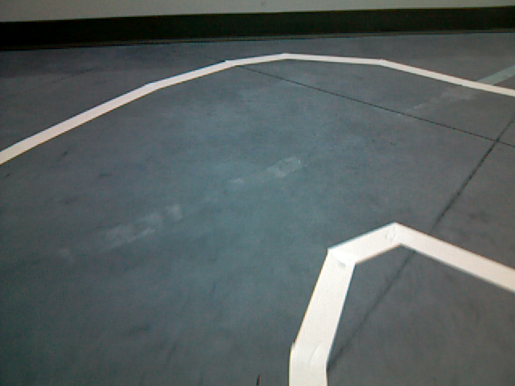 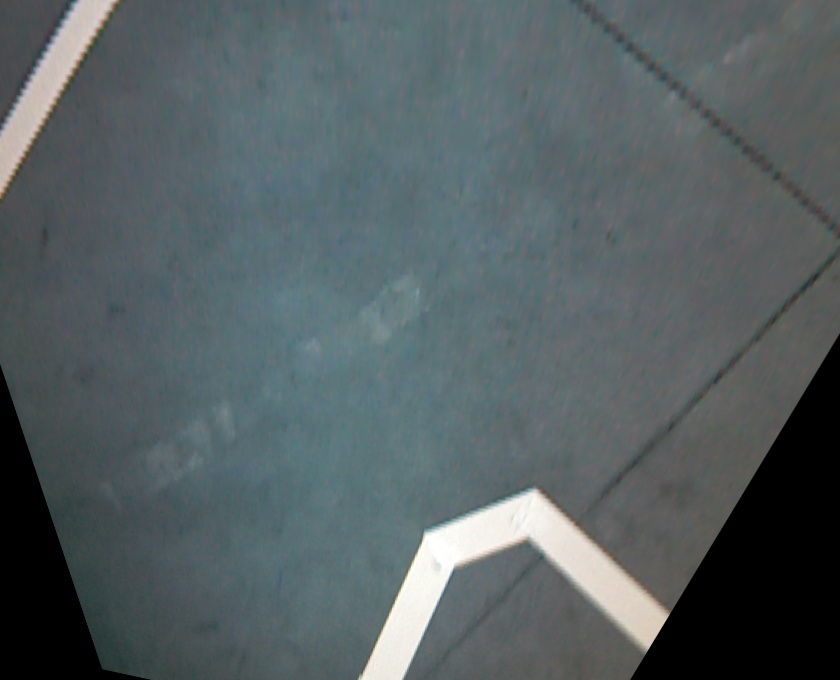 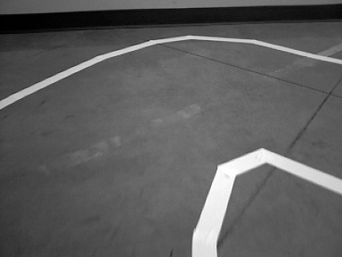 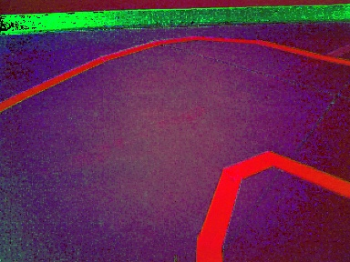
</div>
<div align="center">
  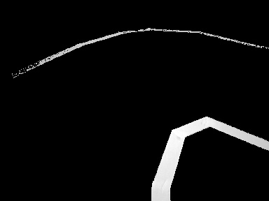 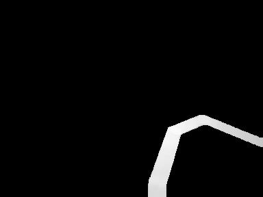  
</div>


## Performance Video
<div align="center">
  <a href="https://www.youtube.com/watch?v=YSfXsihIQsc"></a>
</div>
<div align="center">
  <a href="https://www.youtube.com/watch?v=-dGZnNCPr4A"></a>
</div>
<div align="center">
  <a href="https://www.youtube.com/watch?v=XfeCy8dq6mw"></a>
</div>

## Discussion
If the robots somehow turns towards left line , it follows the track in backward direction.Sometimes it misses the line on a very sharp turn as it vanishes from the robot's view.The method also relies on the camera setting and also prone to lighting condition where the thresholds are required tuning.Our robot did well in the competition and finished quite earlier than most of the robots. It also had a penalty as per rule of competition when the body went outside the track at a sharp corner.

## Future Work
Variable linear motion can be used instead of fixed linear motion which will help in turning. Also path planning ahead of turn might help reduce the the linear speed adjust turning speed for smooth motion.

## Authors

* [Nazmus Sakib](https://github.com/nsa31)
* **Vivian**
## Acknowledgement 

* [Programming Robots with ROS](https://github.com/osrf/rosbook/blob/master)

